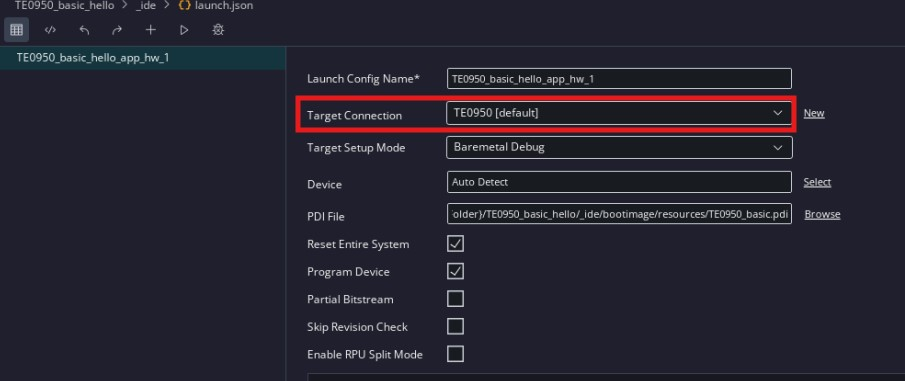

# Minimal Baremetal System (no DDR) on Trenz TE0950 Board

## 1. Introduction
In this design we are exploring the creation of a minimal system running a Baremetal application on the A72. The application is running from **On-Chip Memory**.

## 2. Vivado Project
In this first section we are creating a minimal Vivado project which will only include the CIPS.

1. Create a new Vivado project targeting the TE0950. You can get the board files from Trenz ( [TE Board Part Files - Public Docs - Trenz Electronic Wiki](https://wiki.trenz-electronic.de/display/PD/TE+Board+Part+Files))

2. Create a block design

3. Add a CIPS IP

4. Click on **Run Block Automation**

5. Keep the default options and click OK

> Note: This feature will use the board files from Trenz to configure the CIPS based on the TE0950 board (for example set the correct PS peripherals and IOs)

6. Click **Hierarchy** and Expand Design Sources Folder, right-click on the Block Design and select **Create HDL Wrapper**. Select **Let Vivado manage wrapper and auto-update** and click **OK**.

7. Right-click on the Block Design on more time and select Generate Output Products. Click **Generate**.

8. In the Flow navigator, click on **Generate Device Image**

> Note: The vivado project can be created by running **make vivado** from the 01_TE0950_basic folder

## 3. Vitis Workspace
In this second section we are creating a fixed embedded platform with a baremetal domain. Then we are creating an application component with an Hello World application and running on the board using JTAG

### 3.1. Platform Compoment
First we are creating the platform component

1. Open Vitis and select a workspace

2. Click on **File** > **New Component** > **Platform**

3. Set the name of the platform, for example TE0950_basic, and click **Next**

4. Select the XSA which was generated from the Vivado Project (under 01_TE0950_basic/vivado/build/TE0950_basic.xsa if built from Makefile) and click **Next** and **Finish**

5. Set the following settings:
- **Operating system**: standalone
- **Processor**: psv_cortexa72_0
- **Select Compiler**: GCC Compiler

6. In the Vitis Flow navigator, click on **Build** for the **TE0950_basic** platform component

### 3.2. Application Component
Then we are creating the application component for the baremetal application

1. Click on **File** > **New Component** > **Application**

2. Name the component **TE0950_basic_hello** and click **Next**

3. Select the **TE0950_basic** platform created previously and click **Next**

4.  Select **standalone_psv_cortexa72_0** as the target domain and click **Next**

5. Add the folder **src** folder from TE0950_Designs/01_TE0950_basic/vitis/ and click **Next** and then **Finish**

6. In the flow navigator, make sure **TE0950_basic_hello** is selected and click **Build**

> Note: The full Vitis workspace can be created by running **make vitis** from the 01_TE0950_basic folder

### 3.3. Application Run via JTAG
Finally we will run the application through JTAG. The following steps assume the following switch configuration on the TE0950:
- S2 [1:3] - [OFF, OFF, OFF] - JTAG Boot
- S4 [1:3] - [OFF, ON, OFF] - Only the Versal device in the chain

The board also needs to be connected to a PC using a USB cable plugged in J2

If the TE0950 is connected locally to the PC running Vitis go directly to step 6. If the board is connected to a remote PC, start from step 1.

1. On the remote PC, get the IP address (make sure you can ping the PC running Vitis)

2. Still on the remote PC, run Vivado HW server (you need to have Vivado or Vivado Lab Edition installed)

3. In Vitis click **Vitis** > **Target Connection...**

4. Click on the **+** icon to add a new target

5. Set a target **Name** and add the IP address of the **Host**. If the board is connected and Powered ON, you should see the xcve2302 device listed under **Advanced**. Click **OK** to confirm the settings.

6. In the flow navigator, click on the configuration icon which appears when you hover the right side of the **Run** line with your mouse

7. Make sure the **Target Connection** is set to the remote one you have configured in step 1 to 5 if the board is connected remotely. If the board is connected on the machine running Vitis, just set the setting to **local**

8. Open a UART terminal (for example Tera Term) can connect to the COM port corresponding to the TE0950 board with the following settings
- **Speed**: 115200
- **Data**: 8-bit
- **Parity**: None
- **Stop Bits**: 1 bit

9. In Vitis, click on **Run** in the Flow navigator

In Tera Term you will see the output from the Versal PLM then the Hello World messages from the application

Copyright © 2025 Florent Werbrouck
