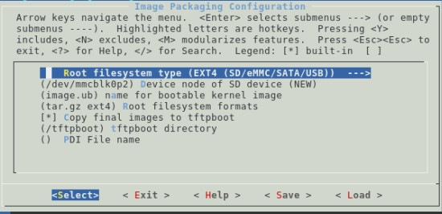
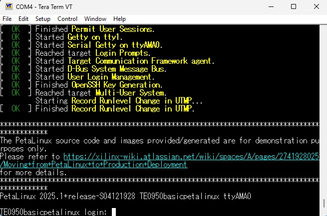

# Minimal Linux System on Trenz TE0950 Board

In this example we are using the desing from <a href="../02_TE0950_basic_DDR/">02_TE0950_DDR</a> and building linux for this platform

## 1. Vivado Project

For steps to create the Vivado Design manually, refer to <a href="../02_TE0950_basic_DDR/">02_TE0950_DDR</a>.

> Note: The vivado project can be created by running `make vivado` from the 03_TE0950_Basic_Linux folder.

## 2. Petalinux Project

1. Create a petalinux project with Versal template using the following command

`petalinux-create project --template versal --name TE0950_basic_petalinux`

2. cd into the petalinux project directory

`cd TE0950_basic_petalinux`

3. Import the hardware configuration using the XSA

`petalinux-config --get-hw-description TE0950_Designs/03_TE0950_Basic_Linux/vivado/build/TE0950_basic_DDR.xsa`

4. In the petalinux configuration wizard, under `Image Packaging Configuration`, change the following settings to let PetaLinux generate EXT4 rootfs.
   1. Set `Root File System Type` to `EXT4`

   2. Set `Root filesystem formats` to `ext4 tar.gz`

   3. Set `Device node of SD device` to `/dev/mmcblk1p2`

   >Note: This setting is because the SD card is connected to the second SD controller of the Processing System

 
5. To allow Linux to boot from EXT4 partition we need to change the bootargs settings. Under `DT settings` > `Kernel Bootargs`:

   1.  Set `generate boot args automatically` to `No`

   2. Set `user set kernel bootargs` to `console=ttyAMA0 earlycon=pl011,mmio32,0xFF010000,115200n8 clk_ignore_unused root=/dev/mmcblk1p2 rw rootwait cma=512M `

6. Add the board device tree file

   1. Copy the file from `03_TE0950_Basic_Linux/os/petalinux/src/recipes-bsp/device-tree/files/TE0950.dtsi` to `TE0950_basic_petalinux/project-spec/meta-user/recipes-bsp/device-tree/files`

   2. Open the file `TE0950_basic_petalinux/project-spec/meta-user/recipes-bsp/device-tree/device-tree.bbappend` and change the following line
   `SRC_URI:append = "file://system-user.dtsi"`
   to
   `SRC_URI:append = "file://system-user.dtsi file://TE0950.dtsi"`

   3.  Open the file `TE0950_basic_petalinux/project-spec/meta-user/recipes-bsp/device-tree/files/system-user.dtsi` and add the following line at the top of the file:
   `/include/ "TE0950.dtsi"`

7. Build the petalinux project

`petalinux-build`

8. Package the image

`petalinux-package boot --u-boot`

9. Create an SD Card image

`petalinux-package wic`

10. On Widnows, use a tool to write SD Card such as Win32DiskImager and burn the SD Card using the `petalinux-sdimage.wic` SD Card image file which is located under `TE0950_basic_petalinux/images/linux`

11. Insert the SD Card in the TE0950 board and ensure the boot mode is set to SD card
   - S2 [1:3] - [OFF, ON, OFF] - SD Boot

12. Power On the TE0950 board

13. Open a UART terminal (for example Tera Term) can connect to the COM port corresponding to the TE0950 board with the following settings
- **Speed**: 115200
- **Data**: 8-bit
- **Parity**: None
- **Stop Bits**: 1 bit

You will see Linux booting correctly up to the linux prompt

Copyright © 2025 Florent Werbrouck

