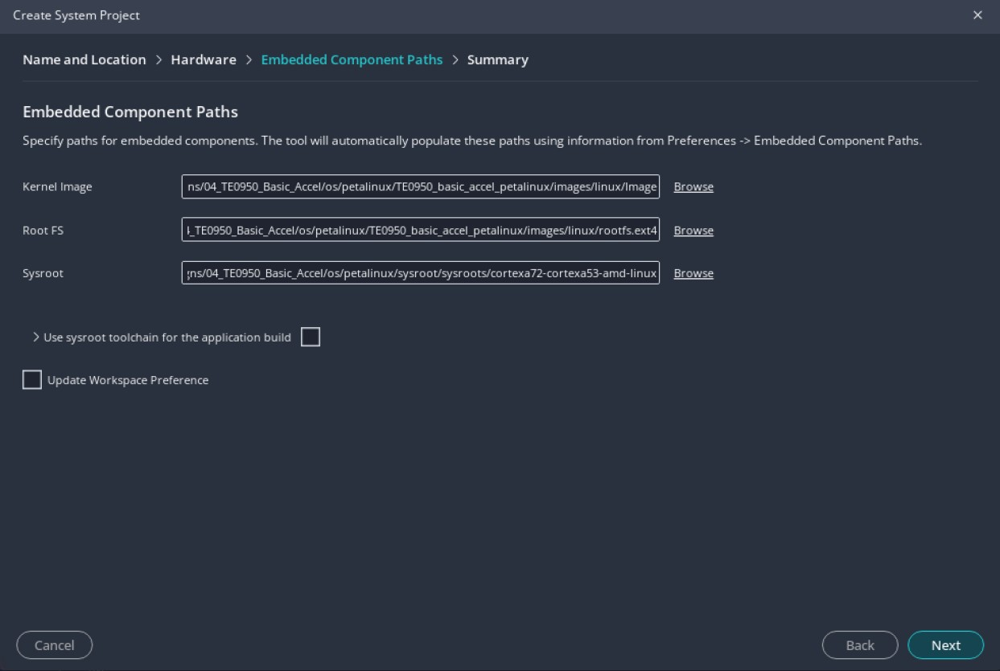

# Minimal Acceleration System running Linux on Trenz TE0950 Board

In this example we are using the custom Vivado™ Configurable Example Design from <a href="../04_AMD_Vivado_Custom_Configurable_Example">04_AMD_Vivado_Custom_Configurable_Example</a> as a starting point to create a Vitis Acceleration Platform.
After generating the design we will show how to build the petalinux project for Vitis Acceleration using the petalinux project from <a href="../03_TE0950_Basic_Linux/">03_TE0950_Basic_Linux</a> as a starting point then we will create the Platform in AMD Vitis. And finally we will run a quick project to ensure this is working as expected.

## 1. Introduction to Vitis Acceleration Platform

An acceleration platform is the starting point of your design and will be used to build AMD Vitis™ platform applications.

An acceleration platform is a platform for which you create a base Vivado design, usually containing the CIPS, the NoC, IO connectivity as well as your traditional RTL logic. This base design will then be modified by Vitis to add additional logic such as HLS kernel or AI Engine connectivity. This modification of the design by the AMD Vitis tool is what is called the acceleration.


## 2. AMD Vivado™ Project

The first step is to create the AMD Vivado (2025.1) project based on the custom Configurable Example Design.

We first have to make sure we are adding the example design to the repo path of Vivado. For this we can add the following line to the Vivado_init.tcl located under ~/.Xilinx/Vivado (you can create one with a text editor if it does not exist)

```
set_param ced.repoPaths [list "<repo download path>/TE0950_Designs/04_AMD_Vivado_Custom_Configurable_Example"]
```

Open Vivado and click on Open Example Project on the Welcome Page (or click File > Project > Open Example). You should see the ***Versal Externsible Embedded Platform (Board Based) Beta*** under ***xflorentw***


Give a project name and select the TE0950 board. Keep the default settings in the design configuration page and click ***Finish***.

We can look at the generated design by opening the block design:


In this design we have the all the blocks required for Vitis acceleration flow on Versal:
- A Block Design which has the following
- A CIPS IP
- A NoC IP
- A clock interface (from the clocking wizard) and the associated reset (from the processor system reset)
- An interrupt controller

There is also the ***Platform Setup*** tab at the top of the Block Design which worth taking a close look at. You can see that you have verious section with the different elements Vitis is going to use:
- The AXI Port section is used to enable AXI4-Memory Mapped to be used by Vitis. This could be to control the kernels that will be added by Vitis (note that there are 15 enabled in this design) or to access the DDR memory via the NoC
- The clock section enables clock to be used in the Vitis regionm to clock the kernels added by Vitis
- And the interrupt section enables interrupt inputs to receive interrupt from the kernels once they have completed their tasks


Before we can export the platform, we need to generate the Block Design by Clicking on ***Generate Block Design*** from the flow navigator.

Then we can set the name for the platform, for example I set ***trenz_te0950_base_2025_1_1_0***. I also set the board and vendor name.


We can now click on ***Export Platform***. In the export platform window I select `Hardware and hardware emulation` and then `Pre-synthesis` to generate the XSA.

> Note: The vivado project can be created by running **make vivado** from the 05_TE0950_Basic_Accel folder

## 3. AMD Petalinux™ Project

We now need to create the linux image, sysroot and rootfs for our new platform. This is very similar to what we have done in <a href="../03_TE0950_Basic_Linux/">03_TE0950_Basic_Linux</a> but we will also add the libraries required for the Vitis™ acceleration flow.

I start by creating a new AMD petalinux (2025.1) project with Versal template then I import the xsa
<pre>
petalinux-create project --template versal --name TE0950_basic_accel_petalinux
cd TE0950_basic_accel_petalinux
petalinux-config --get-hw-description TE0950_Designs/05_TE0950_Basic_Accel/vivado/build/TE0950_basic_accel.xsa
</pre>

Then I used the same settings as we have seen in <a href="../03_TE0950_Basic_Linux/">03_TE0950_Basic_Linux</a>

In the petalinux configuration wizard, under `Image Packaging Configuration`, change the following settings to let PetaLinux generate EXT4 rootfs.
   1. Set `Root File System Type` to `EXT4`

   2. Set `Root filesystem formats` to `ext4 tar.gz`

   3. Set `Device node of SD device` to `/dev/mmcblk1p2`

   >Note: This setting is because the SD card is connected to the second SD controller of the Processing System


 
To allow Linux to boot from EXT4 partition we need to change the bootargs settings. Under `DT settings` > `Kernel Bootargs`:

   1.  Set `generate boot args automatically` to `No`

   2. Set `user set kernel bootargs` to `console=ttyAMA0 earlycon=pl011,mmio32,0xFF010000,115200n8 clk_ignore_unused root=/dev/mmcblk1p2 rw rootwait cma=512M `


Then I added the board device tree file

   1. Copy the file from `05_TE0950_Basic_Accel/os/petalinux/src/recipes-bsp/device-tree/files/TE0950.dtsi` to `TE0950_basic_accel_petalinux/project-spec/meta-user/recipes-bsp/device-tree/files`

   2. Open the file `TE0950_basic_accel_petalinux/project-spec/meta-user/recipes-bsp/device-tree/device-tree.bbappend` and change the following line
   `SRC_URI:append = "file://system-user.dtsi"`
   to
   `SRC_URI:append = "file://system-user.dtsi file://TE0950.dtsi"`
   3.  Open the file `TE0950_basic_accel_petalinux/project-spec/meta-user/recipes-bsp/device-tree/files/system-user.dtsi` and add the following line at the top of the file:
   `/include/ "TE0950.dtsi"`


Then I added the libraries used in the vitis acceleration flow with AI Engine in the rootfs settings
`petalinux-config -c rootfs`

   1. Enable `Filesystem Packages` > `libs` > `xrt`> `xrt`
   2. Enable `Filesystem Packages` > `libs` > `xrt`> `xrt-dev`
   3. Enable `Filesystem Packages` > `libs` > `ai-engine` > `ai-engine-driver`
   4. Enable `Filesystem Packages` > `libs` > `ai-engine` > `ai-engine-driver-dev`
   5. Enable `Filesystem Packages` > `libs` > `ai-engine` > `ai-engine-driver-dbg`
   5. Enable `Filesystem Packages` > `misc` > `sysfsutils` > `libsysfs`
   5. Enable `Filesystem Packages` > `misc` > `sysfsutils` > `sysfsutils`

I can then build the petalinux project
<pre>
petalinux-build
</pre>

Then I created a new directory called `sysroot` outside of the petalinux project and built the sdk and packahed the sysroot folder

<pre>
mkdir ../sysroot
petalinux-build   --sdk
petalinux-package sysroot -d ../sysroot
</pre>

> Note: The petalinux project can be created by running **make petalinux** from the 05_TE0950_Basic_Accel folder

## 4. AMD Vitis™ Acceleration Project

To verify that the project is working, I am mostly following the AI Engine A-to-Z tutorial from AMD:
https://github.com/Xilinx/Vitis-Tutorials/tree/2025.1/AI_Engine_Development/AIE/Feature_Tutorials/01-aie_a_to_z

The main differences are that I am targeting the Trenz TE0950 board and that this will be running Linux (and not Baremetal)

### 4.1. Platform Component
First I  created the platform component in AMD Vitis™ 2025.1. I created a new workspace under 05_TE0950_Basic_Accel/vitis and started Vitis from there.

To create the platform component, I clicked on **File** > **New Component** > **Platform**, gave a name for the platform, for example TE0950_basic_accel_2025_1_1_0, and selected the XSA which was generated from the Vivado Project (under 05_TE0950_Basic_Accel/vivado/build/TE0950_basic_accel.xsa if built from Makefile). 
I used the following settings for the Operating system and Processor:
- **Operating system**: linux
- **Processor**: psv_cortexa72
- **Generate DTB**: Not selected
- **DT Overlay**: Not selected


The platform is now generated with a Linux domain. We still have to tell Vitis where to find the Linux prebuilt directory, the bif file and device tree and to add an ai engine domain to use the AIE-ML array in the Vitis IDE.

First to set the linux image and bif file and device tree, I went in the `vitis-comp.json` setting file for the newly created platform set the following settings for the `linux_psv_cortexa72` domain
- **Bif file** : ../../src/platform/linux.bif
- **Pre-Built Image Directory** : ../../../os/petalinux/TE0950_basic_petalinux/images/linux
- **DTB File** : ../../../os/petalinux/TE0950_basic_petalinux/images/linux/system.dtb


Then to add the ai engine domain, still in the `vitis-comp.json`, I clicked on the `+` icon to add a domain to the platform and set the following:
- **Name:** : aie-ml
- **Display Name:** : aie-ml
- **OS** : aie_runtime
- **Processor** : ai_engine

To build the platorm, I just clicked on on **Build** for the **TE0950_basic_accel_2025_1_0** platform component in the Vitis Flow navigator.

Note that there is an export folder under the platform component that you can point to if you need to reuse this platform in other workspace:
workspace/TE0950_basic_accel_2025_1_1_0/export/TE0950_basic_accel_2025_1_1_0/

### 4.2. AI Engine Application Component

To get started with our first AI Engine application, we do not have to learn coding, we can simply use an example application provided in Vitis.

To view the available examples we can click on View > Examples. I used the simple example which is available under AI Engine Examples > Installed AI Engine Examples


I set the component name as ***aie_component_simple*** and selected the **TE0950_basic_accel_2025_1_1_0** platform that I have build just before.

   

>**NOTE 2:** In the Vitis Unified IDE you can also select the device directly (xcve2302) and link the platform later in the flow


The I have build the ai engine component by clicking on **Build** under **AIE SIMULATOR/ HARDWARE** for the **aie_component_simple** component.

### 4.3. PL (HLS) Kernel Components
In this example, HLS kernels are used which bridge between memory and the AXI4-Stream interface to input and output data from memory.

* The `mm2s` kernel reads data from memory and inputs it to the AI Engine array.
* The `s2mm` kernel receives output data from the AI Engine array and writes it to memory.

The source files are from AMD and available as open source in most of their tutorials:
https://github.com/Xilinx/Vitis-Tutorials/blob/2025.1/AI_Engine_Development/AIE/Feature_Tutorials/01-aie_a_to_z/src/mm2s.cpp
https://github.com/Xilinx/Vitis-Tutorials/blob/2025.1/AI_Engine_Development/AIE/Feature_Tutorials/01-aie_a_to_z/src/s2mm.cpp

I first created the HLS component for the MM2S kernel ***File > New Component > HLS*** and named it **mm2s**

In the **Configuration File** page, I kept the default settings (**Empty File**).

In the **Add Source Files** page, I added the file **mm2s.cpp** from the `vitis/src/hls` folder and set the mm2s function as the top function (click ***Browse*** and select ***mm2s***)

   
   


In the **Select Platform** Page, I selected the **TE0950_basic_accel_2025_1_1_0** platform

In the **Edit Settings** page, I selected ***Vitis Kernel Flow Target*** under **flow_target** and ***Generate a Vitis XO*** under **package.output_format**

   

To synthesis the code, in the Vitis Flow navigator, I clicked on **Run** under **C SYNTHESIS** for the **mm2s** component and click **Run** on the next window.
Once the C synthesis is complete, we can package the IP by clicking on **Run** under **PACKAGE*** for the **mm2s** component.

In the next window, selected `xo` as **output.format** and click **Run**.

   

I then repeated the same steps to create another HLS component called **s2mm** with the **s2mm.cpp** source file.

### 4.4. Host Application Component

The next step was to create the host application which will run on the Processing System, control the excecution of the AI Engine, feed the AI Engine and verify thev output.

To create the host application in the Vitis Unified IDE, I clicked ***File > New Component > Application***, set the component name as **host_app** and selected the **TE0950_basic_accel_2025_1_1_0** platform, selected **linux_psv_cortexa72** for the domain.

I then selected `TE0950_basic_accel_petalinux/os/petalinux/sysroot/sysroots/cortexa72-cortexa53-amd-linux` for the Sysroot and added the files from `vitis/src/sw` as sources.

Once the host application compoment is created we need to tell him where to find the libraries required by the application. This is done in the  the compiler setting file **UserConfig.cmake**. I set the following settings:
- **Compiler Settings > Directories** : add the following paths:
`TE0950_basic_accel_petalinux/os/petalinux/sysroot/sysroots/cortexa72-cortexa53-amd-linux/usr/include/xrt`
`TE0950_basic_accel_petalinux/os/petalinux/sysroot/sysroots/cortexa72-cortexa53-amd-linux/usr/include`
- **Compiler Settings > Miscellaneous > C++ standard** : 17
- **Linker Settings > Libraries**: add xrt_coreutil


Then I build the component by clicking on **Build** under **HARDWARE** for the **host_app** component in the Vitis Flow navigator, 


### 4.5. System Project Component

At this point, all the components (PS application, AI Engine graph and HLS kernels) are created and built individually. The next step is to group them in a system project component and tell vitis how to connect everything together..

To create a new System Project component, clicked ***File > New Component > System Project***, nemed this system component **basic_accel_system_project** and selected the **TE0950_basic_accel_2025_1_0** platform.

In the **Embedded Component Paths** page I set the following settings:
- **Kernel Image**: `TE0950_basic_accel_petalinux/os/petalinux/TE0950_basic_accel_petalinux/images/linux/Image`
- **Root FS**: `TE0950_basic_accel_petalinux/os/petalinux/TE0950_basic_accel_petalinux/images/linux/rootfs.ext4`
- **Sysroot**: `TE0950_basic_accel_petalinux/os/petalinux/sysroot/sysroots/cortexa72-cortexa53-amd-linux`




Once the component is created, we can tell Vitis which components are part of this system. This is done in the settings file called **vitis-sys.json**.
Under **basic_accel_system_project > Settings**, I clicked on ***Add Existing Components*** in the **Components** section at the bottom of the file then clicked ***HLS*** and selected the ***mm2s*** and ***s2mm*** components.

   

I clicked again on ***Add Existing Components*** in the **Components** section at the bottom of the file and clicked ***AI Engine*** and selected the **aie_component_simple*** components.

Finally I did the same for the the **host_app*** components by selection add new ***Application***.


Then we need to tell the Vitis compiler about the connectivity of the system. This step is done using a configuration file. Still in the settings file **vitis-sys.json**, under **Hardware Link Settings** I expend **binary_container_1** and clicked on ***hw_link/binary_container_1-link.cfg***

   

To add the connectivity options, we have to change the view to **Source editor** by clicking on the **</>** icon on **binary_container_1-link.cfg**. We can then add the following lines under **[connectivity]**

      ```
      stream_connect=mm2s_1.s:ai_engine_0.mygraph_in
      stream_connect=ai_engine_0.mygraph_out:s2mm_1.s
      ```
   

This will connect the stream output from the mm2s HLS kernel (which is reading the data from memory and sending it to the stream) to the input of the engine and the output of the AI Engine to the stream input of the s2mm HLS kernel (which will send the received stream data to memory)

The final step of our Vitis project is to set the correct packaging options. In the settings file **vitis-sys.json**, under **Hardware Link Settings** we can click on ***package/package.cfg*** to open the configuration file for the packaging step.

   

The only option that we need to change is the **Do not enable cores** under **AI Engine** that needs to be enabled. This is because in our application, the PS will control the execution of the AI Engine. This option needs to remain unset if the AI Engine is free running.

   

> Note: The Vitis workspace can be created by running **make vitis** from the 05_TE0950_Basic_Accel folder

## 4. Build the System and Run on Hardware

Once we have everyting configured, the last step is to build the system. For this, in the flow navigator, we just need to make sure **basic_accel_system_project** is selected and to click on ***Build All*** under **HARDWARE**. 

The compilation process takes some time to finish. The underlying AI Engine application project, hardware kernel project, and hardware linking project are compiled one after another. The system should build successfully with no error.

In the build results, Vitis is generating an SD card image with the linux image and our application included. We can use this SD card image directly.

To burn the SD card I used Win32DiskImager on Widnows. As input I used the `sd_card.img` SD Card image file which is located under `05_TE0950_Basic_Accel/vitis/workspace/system_project/build/hw/package/package`.

Once the SD card is ready we just have to insert it into the board and set the correct boot mode on the TE0950 board
   - S2 [1:3] - [OFF, ON, OFF] - JTAG Boot

To check the output we can open a UART terminal (for example Tera Term) and connect to the COM port corresponding to the TE0950 board with the following settings
- **Speed**: 115200
- **Data**: 8-bit
- **Parity**: None
- **Stop Bits**: 1 bit

We can see Linux booting correctly up to the linux prompt

Once in the linux prompt we can connect using `petalinux` user (password will be set during furst connection) and run the following command to run the application:

<pre>
sudo -i
cd /run/media/mmcblk1p1/
./host_app ./binary_container_1.xclbin
</pre>

We can see the application running successfully which means that we have correctly configured our system as well as our Linux.

   

<p class="sphinxhide" align="center"><sub>Copyright © 2025 Florent Werbrouck</sub></p>